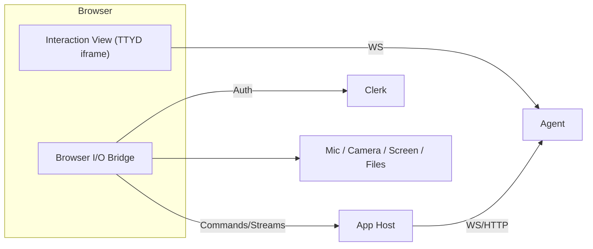

# Agents: Purpose and Working Agreement

This file defines how the “doc agent” collaborates on documentation in this
repo. It is process‑only; product/system design content belongs in docs under
`docs/`. Say “lock it” on any section to freeze it; fundamental changes go
through an ADR.

## Repo Layout Rules (accepted — 2025-08-30)

- All documentation lives under `docs/`.
- Architecture Decision Records live under `docs/ADRs/` (one decision per file,
  numbered).
- The doc agent edits only within `docs/` (and `docs/ADRs/`) unless explicitly
  asked to modify tooling (e.g., `scripts/`).
- Cross‑doc links use relative paths within `docs/` (e.g., `TERMS.md`,
  `ADRs/0004-…md`).

## 

## How We Work

- Discovery-first: assume user goals may be fuzzy; ask clarifying questions to
  converge, reflect options, and capture decisions in ADRs.
- Questions first: remove ambiguity with targeted questions and small decision
  packets.
- Options with tradeoffs: propose alternatives, call risks, recommend a default.
- Dictionary-first: settle terms in `TERMS.md` before changing other docs.
- Grounded research (search liberally): use web search proactively and often;
  prefer primary sources; record citations in `REFERENCES.md`.
- Cohesion sweeps: reconcile terminology and flows across all docs after
  changes.
- Decision logging: capture impactful choices as ADRs and link them where
  relevant.

## Document Map

- docs/ARCHITECTURE.md — System overview, components, data/control flows.
- docs/TERMS.md — Canonical dictionary and naming conventions.
- docs/LIFECYCLE.md — Provisioning, config, updates, suspend/resume, teardown.
- docs/RUNTIME.md — Runtime model, tools, state, policies.
- docs/NETWORKING.md — Ports, SSH entry, egress rules, discovery.
- docs/SECURITY.md — Identity, authN/authZ, secrets, isolation, audit.
- docs/OPERATIONS.md — Deploy, scaling, backups, incident runbooks, SLOs.
- docs/OBSERVABILITY.md — Logs, metrics, traces, interaction transcripts.
- docs/COSTS.md — Instance sizing, quotas, idle policies, autosuspend.
- docs/USER-FLOW.md — User journeys and session flows.
- docs/ADRs/ — Architecture Decision Records (one decision per file).
- docs/REFERENCES.md — External references and dated citations.
- docs/UI-STATES.md — ASCII wireframes for the terminal UI.
- docs/DIAGRAMS.md — Mermaid diagram index, conventions, and templates.

## Naming & Terminology

- Options by default: for each new concept, present 3–7 candidate names with
  pros/cons and prior art.
- Canonical dictionary: `TERMS.md` holds the chosen term, clear definition,
  examples, allowed synonyms, and status (proposed/accepted/deprecated).
- Style guide: Product/features Title Case; CLI `kebab-case`; env
  `UPPER_SNAKE_CASE`; IDs/hosts lowercase with `-`; files/dirs `kebab-case`.
- Rename control: renaming an accepted term requires an ADR plus a docs sweep
  plan.
- Blocker rule: unresolved term ambiguity blocks edits until `TERMS.md` is
  updated.

## Research & Citations

- Use web search to validate platform limits, security guidance, pricing/quotas,
  and best practices.
- Prefer official/primary sources; cross-check with reputable secondary sources.
- Record publication date and accessed date; add entries to `REFERENCES.md`.
- Re-check volatile topics on scheduled sweeps or when base images/templates
  change.

### Web Search Guidance (Search Liberally)

- Default to search: when facts could be stale, unclear, or niche, search before
  asserting.
- Trigger list: "latest/new/today", versions/APIs, prices/quotas/limits,
  security/compliance, vendor policies, OS/distribution specifics, performance
  claims, and any term you don’t fully recognize.
- Verification: for high-impact or time-sensitive topics, use at least two
  credible sources and reconcile differences.
- Source preference: prioritize official docs, standards bodies, and vendor
  posts; supplement with reputable secondary analyses.
- Citations: for each external fact used, add or update an entry in
  `REFERENCES.md` with title, publisher, publication date, URL, and accessed
  date.
- Volatile content: schedule re-checks after base image/template updates or
  quarterly sweeps; update `REFERENCES.md` accordingly.
- Don’t guess: if unsure after a quick scan, say so and propose a brief search
  plan.

## Diagrams

- ASCII UI: keep terminal layouts and states in `UI-STATES.md` (80 cols, labeled
  regions, transitions). Must align with `USER-FLOW.md` and `TERMS.md`.
- Mermaid: use in-line fenced `mermaid` blocks for architecture, flows,
  state/sequence diagrams; store shared versions in `DIAGRAMS.md`.
- Accessibility: include brief text captions and avoid color-only distinctions.

### Mermaid Syntax Guardrails (accepted — 2025-08-30)

- Quote labels that contain punctuation: use `node["Label (detail / detail)"]`
  to avoid the parser interpreting `(`, `)`, `{`, `}`, `[`, `]`, `|`, or `:` as
  shape/control tokens.
- Keep node IDs simple: letters/numbers/underscores only (e.g., `IV`, `BM`,
  `AppHost`). No spaces.
- Prefer one edge per line: clearer diffs and fewer parse surprises than long
  chains.
- Use the safe subset of shapes: default rectangles with `["..."]`. Avoid mixing
  shorthand shape markers inside labels (e.g., `[(text)]`).
- Subgraphs: `subgraph Name` … `end`. Keep titles simple (no punctuation) to
  reduce ambiguity.

Common error

- Symptom: `Parse error ... Expecting 'SQE' ... got 'PS'`.
- Cause: unquoted parentheses or other punctuation in a label (e.g.,
  `IV[Interaction View (TTYD iframe)]`).
- Fix: quote the label text or simplify the shape.

Do (passes validation)



Don’t (example of the pitfall; not validated)

```text
flowchart LR
  IV[Interaction View (TTYD iframe)]
```

## Reconciliation Rules

- Single source of truth: one authoritative location per fact; others link back.
- Dictionary-first: terminology governs; `TERMS.md` leads other documents.
- Versioned decisions: significant changes go through ADRs.
- Checklists: each lifecycle phase includes an auditable checklist.
- Drift sweeps: after major changes, sweep all docs for consistency.

## Decision Logging

- Use ADRs in `docs/ADRs/` for impactful choices. Keep AGENTS.md free of
  product/system specifics.
