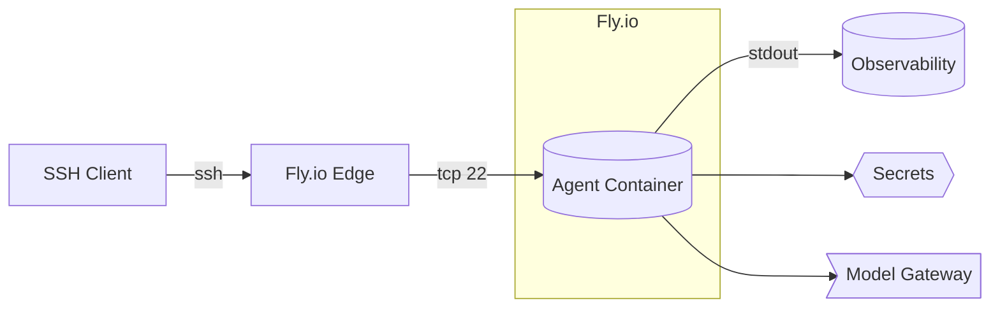
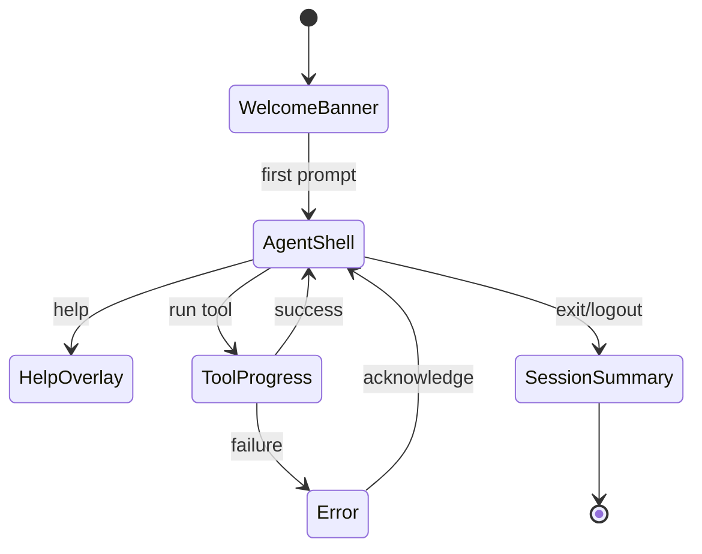
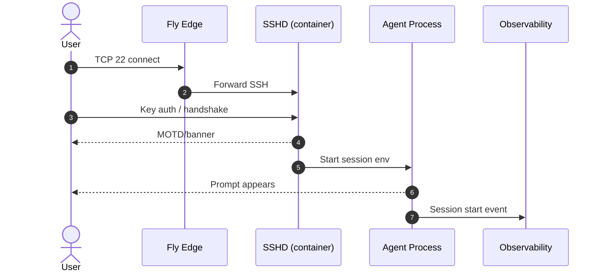
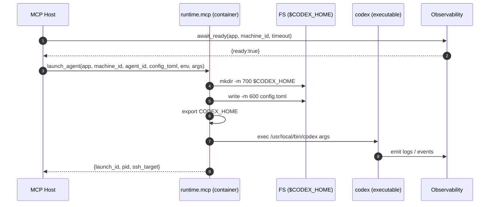
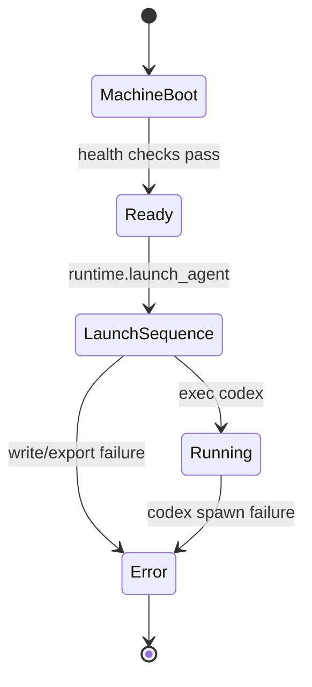

# Diagrams: Mermaid Index & Templates

Use Mermaid to visualize architecture, flows, and behaviors. Keep diagrams close to the docs they explain; add shared or canonical versions here.

## Conventions
- Place diagrams inline in `ARCHITECTURE.md`, `USER-FLOW.md`, etc.; cross-link canonical copies here.
- Prefer: `flowchart`, `stateDiagram-v2`, `sequenceDiagram`.
- Include a short caption and a one-line text summary below each diagram.
- Avoid color-only distinctions; label edges and nodes clearly.

## Architecture (template)

Summary: SSH path from user to agent; supporting services.

## UI State Machine (template)

Summary: High-level SSH TUI states; must match `UI-STATES.md`.

## SSH Login Sequence (template)

Summary: Authentication and session start handshake.

## Launch Sequence (canonical)
Status: accepted/locked 2025-08-28; authoritative for invocation.

Summary: Post-boot MCP call writes config.toml, sets CODEX_HOME, and execs codex.

## Agent Runtime States (canonical)

Summary: Container lifecycle from boot to codex running, highlighting the Launch Sequence.
