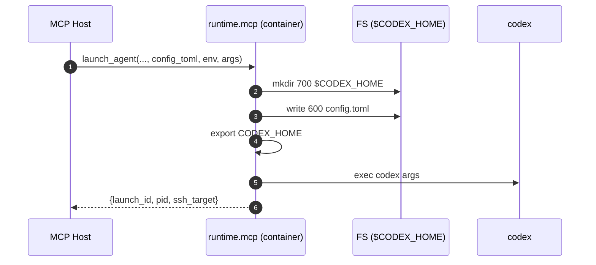

**Runtime Model**

This document defines how an agent process is launched and managed inside its container.

**Launch Sequence (accepted — locked 2025-08-28)**

- Locked: changes require an ADR update (see `ADRs/0002-mcp-invocation-and-codex-home.md`).
- **Trigger:** An `mcp` tool call (`runtime.launch_agent`) is received by the MCP host after the
  container reports Ready.
- **Inputs:** `agent_id`, `app`, `machine_id`, `config_toml` (string), optional `codex_args`
  (array), optional `env` (map), optional `workdir` (string).
- **Steps:**
  - **Create CODEX_HOME:** Make a per‑agent directory (default `/var/lib/codex/agents/{agent_id}`)
    with `0700` perms.
  - **Write config.toml:** Save provided contents to `$CODEX_HOME/config.toml` with `0600` perms.
  - **Assemble env:** Export `CODEX_HOME` (required). Merge `env` overrides, preserving a minimal
    safe `PATH`.
  - **Invoke codex:** `exec /usr/local/bin/codex ${codex_args…}`. The process reads
    `$CODEX_HOME/config.toml`.
  - **Wire IO:** STDOUT/ERR stream to container logs; optionally tee to observability.
  - **Return handle:** Tool returns `{launch_id, pid, ssh_target}`.

See also: canonical diagrams in `DIAGRAMS.md` under “Launch Sequence (canonical)”.



Caption: Launch Sequence from MCP call to codex exec.

**Reference Implementation (launcher shim)**

```bash
#!/usr/bin/env bash
set -euo pipefail

agent_id=${AGENT_ID:?missing}
CODEX_HOME="/var/lib/codex/agents/${agent_id}"

install -d -m 700 "${CODEX_HOME}"
install -m 600 /dev/stdin "${CODEX_HOME}/config.toml"

export CODEX_HOME
exec /usr/local/bin/codex "$@"
```

Call over SSH from the MCP host with the `config.toml` piped on STDIN.

**Error Handling**

- **E_CONFIG_WRITE:** Cannot create/write `$CODEX_HOME/config.toml`.
- **E_BAD_ARGS:** Invalid `codex_args` or env values.
- **E_SPAWN:** `codex` missing or not executable.

**Security Notes**

- `CODEX_HOME` is per‑agent and not shared; use volume mounts only if persistence is required.
- File perms are restrictive (`0700` dir, `0600` file). Never echo configs to world‑readable logs.

**Fly.io Boot‑Time Config**

- **Goal:** Provide `config.toml` at machine creation without post‑boot steps.
- **Mechanism:** Fly Machines “files” feature writes content into a path inside the guest during
  create/update. No SSH needed; content is present before your process starts. See `REFERENCES.md`
  entries `FLY-MACHINES-RUN`, `FLY-MACHINES-CREATE`, and `FLY-APP-FILES`.

**Recommended (literal → path)**

- Use `--file-literal` to inject the TOML contents directly:

```bash
# Create & start a Machine, writing config at boot
fly machine run <image> -a <app> \
  --file-literal /etc/agent/config.toml="$(< ./config.toml)" \
  --cmd "codex --config /etc/agent/config.toml"

# Or do the same on low-level create
CONFIG_TOML="$(< ./config.toml)"
fly machine create -a <app> --image <image> \
  --file-literal /etc/agent/config.toml="$CONFIG_TOML" \
  --cmd "codex --config /etc/agent/config.toml"

# Update/rotate later without SSHing into the guest
fly machine update <machine_id> \
  --file-literal /etc/agent/config.toml="$(< ./config.toml)"
```

Notes:

- You can pass plaintext to `--file-literal`; flyctl Base64‑encodes it for `files.raw_value`, and
  the Machines agent decodes and writes the original bytes to the path at create/update. You do not
  need to pre‑encode. The `machine create -h` text mentions Base64 because the underlying
  `raw_value` field is Base64 in the API/config. See refs.
- For very large configs, prefer `--file-local` or mount a volume; there’s a practical size limit
  for values embedded in Machine config.
- Sensitive configs: store in Secrets and project them as a file via
  `--file-secret /path=SECRET_NAME`.

**Launcher Interop**

- If the file is provided at `/etc/agent/config.toml`, the launcher MAY skip stdin write and point
  codex at that path. If both are provided, launcher precedence is: explicit stdin > existing file.
