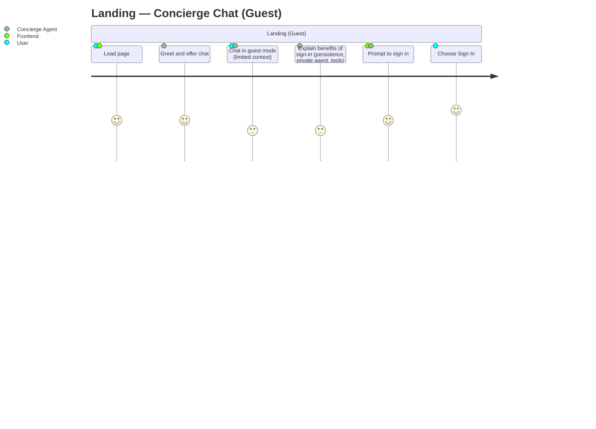
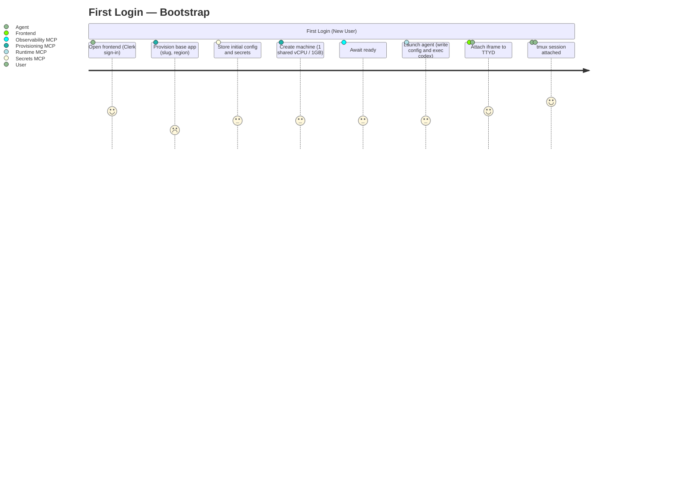
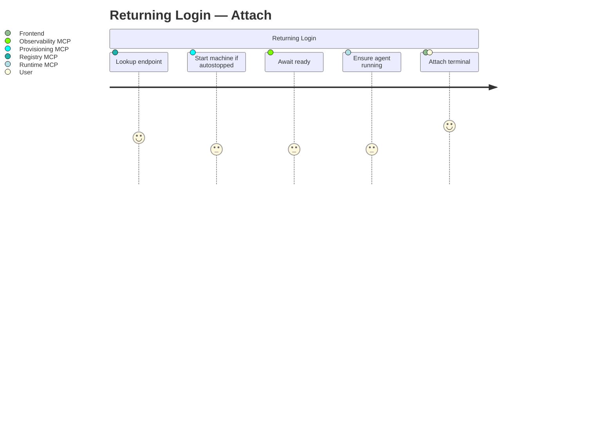
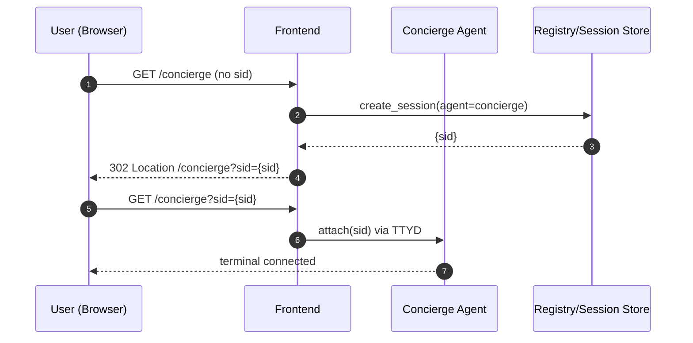
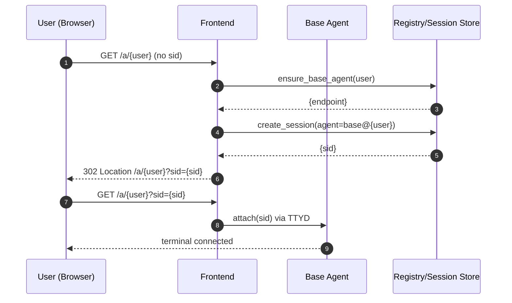

**New User Bootstrap Flow**

- **Entry Point:** User opens the Frontend Web App, authenticates with Clerk, and lands on the
  workspace page. The terminal UI is an iframe rendering a TTYD endpoint.
- **Goal:** If first-time, provision a dedicated “base agent” on Fly.io and point the iframe at that
  agent’s terminal; otherwise, attach to the user’s existing base agent session.

**Assumptions**

- **Per-user app:** One Fly app per user; exactly one Machine (base agent) inside it.
- **Standard image:** Base agent uses a common image configured at boot (no volumes).
- **MCP-backed ops:** Frontend/concierge calls MCP servers for provisioning, auth/registry, secrets,
  observability, and runtime.
- **Terminal transport:** Browser → Frontend page → iframe → agent’s TTYD (WebSocket). Sessions
  inside the agent are managed with `tmux`.

**User Journey — Landing (Guest Chat)**

Caption: Pre-auth landing flow where the Concierge chats in guest mode and nudges sign-in for full
features.

**User Journey — First Login**

Caption: First-time user bootstrap phases, actors, and experience ratings.

**User Journey — Returning Login**

Caption: Returning user attach flow with health gates and ratings.

**Happy Path (First Login)**

- **U1. Sign-in:** User authenticates with Clerk in the frontend.
- **U2. Identify:** Frontend resolves `user_id` and `username` via Clerk; Registry MCP lookup for
  existing base agent.
- **U3. Provision App:** If missing, Provisioning MCP creates Fly app named from the Clerk
  `username` (slug-safe), using the default Fly org and a region nearest to the user.
- **U4. Config/Secrets:** Secrets MCP stores initial agent config and MCP endpoints.
- **U5. Launch Machine:** Provisioning MCP creates one Machine with the standard image, CPU/RAM:
  `1 shared vCPU, 1GB RAM`; no volumes.
- **U6. Health Gate:** Observability MCP waits for container readiness.
- **U7. Launch Agent:** Call `runtime.mcp.launch_agent` (see RUNTIME “Launch Sequence”) to write
  `config.toml`, set `CODEX_HOME`, and exec `codex`.
- **U8. Attach:** Frontend sets the iframe `src` to the agent’s TTYD endpoint; the agent
  starts/attaches a `tmux` session for the user.

**Repeat Login (Existing User)**

- **R1. Lookup:** Frontend/Registry MCP finds the base agent endpoint.
- **R2. Ensure Up:** If autostopped/suspended, Provisioning MCP (or Fly Proxy autostart) brings it
  up; Observability MCP gates on health.
- **R2a. Ensure Agent:** If `codex` is not running, call `runtime.mcp.launch_agent`.
- **R3. Attach:** Frontend points the iframe to the TTYD URL and reattaches the user’s `tmux`
  session.

**Failure Handling (Sketch)**

- **F1. Provision error:** Show concise error + incident code; offer retry or support link.
- **F2. Health timeout:** Offer logs tail from Observability MCP; keep user on the frontend page.
- **F3. Auth mismatch:** Deny with clear message; session remains on frontend.

**Notes on “Handoff”**

- In this model, “handoff” simply means routing the iframe to the per-user agent’s TTYD URL. No SSH
  jump or client command is involved.

**Artifacts Produced**

- Per-user Fly app and Machine
- Stored config/secrets for the agent
- Registry entry linking user → app → machine → hostname
- Observability streams wired (logs/metrics)

**Defaults and Policies**

- **App name:** derived from Clerk `username` (slug-safe).
- **Org:** Fly default org.
- **Region:** nearest Fly region to user at first provision.
- **Sizing:** 1 shared vCPU, 1GB RAM.
- **Storage:** no volumes.
- **Idle policy:** suspend/stop on idle via Fly Proxy autostop; autostart on new HTTP/WebSocket
  traffic.
- **Sessions:** managed via `tmux`; multiple viewers may attach when allowed by frontend.

**Open Items**

- Region selection method: compute nearest Fly region from request IP, or show a picker with a
  sensible default.

---

**Web Session Routing (proposed)**

- **Default page → Session URL:** Landing on a page without a `sid` param creates a new session on
  the target agent (Concierge or Base) and redirects to the Session URL including `?sid={session_id}`.
- **Resume with sid:** Landing with a valid `sid` reattaches to that session; invalid/expired `sid`
  yields a friendly error and an option to start a new session.
- **No per-user container for Concierge:** Concierge operates as a shared agent container hosting
  many sessions; users get sessions, not containers.
- **Multiple tabs:** Each browser tab has its own `sid`; viewers may attach to the same `sid` when
  authorized.

Caption: Default concierge page redirects to a Session URL and attaches that session.

Caption: Base agent page ensures agent exists, then creates and attaches a session.
