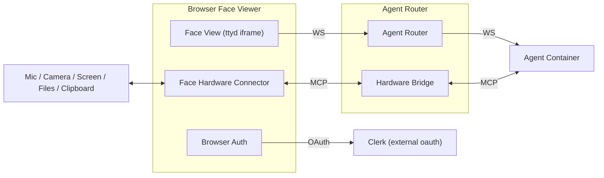
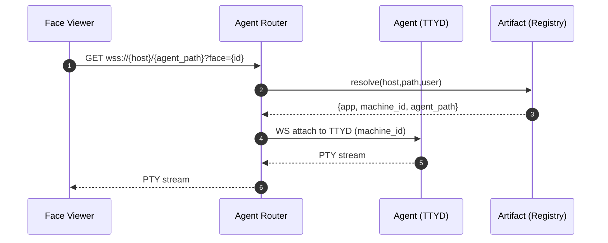

**System Architecture (snapshot — 2025-08-30)**

This document sketches the high-level components and how they interact. Terms
are governed by `TERMS.md`. Decisions that materially change flows require an
ADR.

---

**Face Viewer (proposed)**

- **Face Viewer:** The browser page that renders one active `face_id` at a time
  (typically via a TTYD iframe) and follows the Face Model in `RUNTIME.md`.
- **Face Hardware Connector (Mgmt Layer):** Frontend logic that authenticates
  the user (Clerk), exposes device/resource access (microphone, camera, screen,
  files, navigation), and executes device-like commands from the server-side
  shell to make the browser/computer behave like controllable hardware.

Responsibilities

- **Auth:** Use Clerk to identify the user and attach identity/claims to I/O
  requests.
- **Device Mediation:** Prompt, request, and manage browser resources using
  standard Web APIs.
- **Command Handling:** Receive commands from the agent/server, open/close
  resources, and stream data or events back with device-like semantics
  (enumerate/open/read/write/close, error codes).
- **Isolation:** Scope resources to the active `face_id`; do not leak between
  faces/tabs.

Caption: The Face Viewer has two subcomponents: the Viewer and the Face Hardware
Connector. The connector authenticates with Clerk and mediates device access in
response to commands originating from the server-side shell via the Agent
Router.

Notes

- Transport between Face Viewer ↔ Agent Router ↔ Agent may be WebSocket; media
  MAY use WebRTC or WebSocket streams. Exact transports are implementation
  choices; command contract is the source of truth.
- See `RUNTIME.md` → “Face Hardware Connector (proposed)” for the command
  surface.

---

**Agent Router (proposed)**

- **Role:** Public entrypoint acting as a router and proxy. It may serve static
  assets or delegate them to a static host. It authenticates users (Clerk),
  resolves the target app/agent from host/path, and attaches the Face Viewer to
  a specific Machine’s face.
- **Routing:** Based on URL host + path + auth, map to
  `{app, agent_path, face}`. May issue 302 redirects to move users to the
  correct subdomain/path that matches their auth context.
- **Proxies:**
  - Terminal WS proxy: Face Viewer ↔ Agent Router ↔ Agent TTYD.
  - Hardware MCP proxy: Agent ↔ Agent Router (MCP) ↔ Face Hardware Connector.
- **Policy:** Enforces which hardware capabilities an agent may access for the
  current user/app.
- **Assumption:** Agent Machines expose Faces (TTYD) without auth; the Agent
  Router gates access.

Caption: Agent Router resolves routing and proxies the terminal WebSocket to the
target Machine.

---

**Agent & Faces (reference)**

See `RUNTIME.md` and `ADRs/0003-face-model-multi-face-per-agent.md` for the Face
model and concurrency. The Face Viewer narrows how a page attaches to one Face
while also exposing device bridges.
