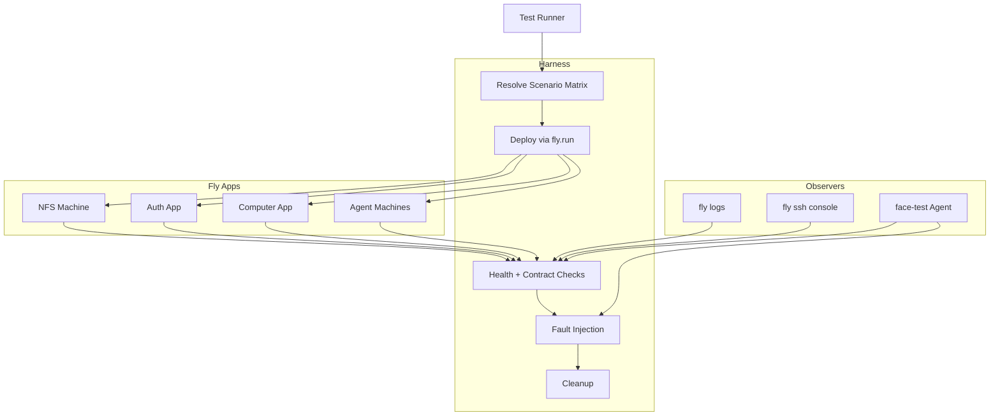

# End-to-End Testing Options

This guide outlines how to exercise the NFS server, auth server, computer apps,
and agent stack end to end. It focuses on Fly.io deployments and provides
patterns that let agents safely run `fly` commands to validate features in
isolation and as a complete system, including unhappy-path coverage.

## Goals and Scope

- Validate data flow from Fly deploy orchestration through NFS, auth, computer,
  and agent layers.
- Exercise both happy and unhappy paths without disrupting production apps.
- Allow autonomous agents (via MCP) to run Fly commands under guard rails.
- Reuse Fly app configs (`fly.nfs.toml`, `fly.auth.toml`, `fly.computer.toml`,
  `fly.agent.toml`) across environments.

## Core Components Under Test

- **Fly NFS (`fly-nfs`)**: Provides the exported volume mounted by other apps.
- **Fly Auth (`fly-auth`)**: Issues auth tokens/claims and exposes user-facing
  endpoints backed by Clerk.
- **Fly Computer (`fly-computer`)**: Hosts the computer-facing APIs that agents
  bind to; depends on auth and NFS availability.
- **Agent Dev Suite (`agent-dev-suite`)**: Runs machines that host MCP agents
  and exposes faces/TTYD; enforces NFS mount checks and serves hardware bridges.
- **Orchestrator**: The test driver (often a Deno script within `tasks/`) that
  issues Fly API calls, coordinates assertions, and records evidence.
- **Observer Tooling**: `fly logs`, `fly ssh`, metrics dashboards, and MCP-based
  inspectors (e.g. `face-test`, `face-inspector`).

## Environment Options

| Option                               | Description                                                                                      | Fit                                   | Notes                                                                                                                      |
| ------------------------------------ | ------------------------------------------------------------------------------------------------ | ------------------------------------- | -------------------------------------------------------------------------------------------------------------------------- |
| **Ephemeral staging**                | Create a new Fly org app name suffix (e.g. `*-e2e-<ulid>`) per test run and deploy all four apps | Best isolation, parallelizable        | Use `fly deploy --config fly.<name>.toml --app <app>-e2e-<id>` and tear down with `fly apps destroy` when assertions pass. |
| **Shared staging**                   | Keep a long-lived `*-staging` stack and reset state between runs                                 | Lower cost, slower to parallelize     | Include cleanup steps (`fly volumes list`, `fly machines stop`) to avoid run-to-run interference.                          |
| **Local orchestrator w/ Fly remote** | Run the test controller locally (via `deno task ok`) and talk to Fly API                         | Useful for rapid iteration            | Cache Fly tokens via `fly auth token` and keep secrets in `.env.local.e2e` loaded with `@std/dotenv`.                      |
| **Hybrid fixture pool**              | Pre-create NFS + auth, spin up computer + agent per scenario                                     | Fastest for agent interaction testing | Add health probes that verify NFS mounts before starting scenario scripts.                                                 |

## Control Plane Patterns

- **Declarative Deploy Step**: Wrap each `fly deploy` in a helper that tags the
  Git SHA, config name, and scenario ID. Store outputs so failures can be
  correlated.
- **Fly API Usage**: Use the Fly Machines API (`/apps/{app}/machines`) to create
  disposable machines for fault injection (e.g. halt NFS) without touching
  production machines.
- **State Tracking**: Maintain a run manifest (JSON) capturing app names, volume
  IDs, machine IDs, secrets injected, and agent credentials. Persist it in the
  workspace (e.g. under `artifacts/e2e/<timestamp>.json`).
- **Cleanup Guarantees**: Always attempt cleanup in `finally` blocks: destroy
  machines, detach volumes, revoke tokens.

## Agent-Driven Deployment Pattern

1. **Provision Scoped Tokens**: Create Fly API tokens with `machines:write` and
   `apps:deploy` scope. Store them in Vault/1Password and inject via MCP secrets
   interface so agents never see raw tokens.
2. **Command Envelope**: Define an MCP tool (see `@modelcontextprotocol/sdk`)
   such as `fly.run` that accepts `{cmd, app, config, env}`. The tool should run
   `fly` via a supervised shell (`procman`) and redact secrets from logs.
3. **Policy Hooks**: Validate that `cmd` matches an allowlist (`deploy`,
   `status`, `logs`, `ssh console`). Reject destructive operations
   (`apps destroy`) unless the scenario explicitly flips a feature flag.
4. **Observation Channel**: Stream command output back to the orchestrator so it
   can assert on textual evidence (e.g. "mounted volume" logs).
5. **Rehearsal Mode**: Support `dryRun: true` to call `fly config validate` or
   `fly deploy --dry-run` whenever possible, letting agents test syntax without
   mutating state.

## Recommended Test Flow

## Scenario Matrix

| ID             | Purpose                                | Happy Path Assertion                                                      | Unhappy Path Variant                                                                                          |
| -------------- | -------------------------------------- | ------------------------------------------------------------------------- | ------------------------------------------------------------------------------------------------------------- |
| `NFS-001`      | Verify NFS mount for auth + agent      | `mount` inside auth + agent shows `/mnt/...` active and self-check passes | Stop NFS machine via Fly API; expect auth health endpoint to fail and agents to surface mount error.          |
| `AUTH-010`     | Validate Clerk token issuance          | Auth `/healthz` returns 200 and agent login succeeds                      | Inject invalid Clerk secret; expect 401 and agent to surface login failure while computer app retries.        |
| `COMP-020`     | Ensure computer app reaches NFS + auth | `deno task ok` scenario confirms read/write through NFS and token refresh | Drop network between computer and auth by removing machine check; agent runner should backoff and emit alert. |
| `AGENT-030`    | Agent spawn and face attachment        | `face-test` can open TTYD and execute noop command                        | Kill agent machine mid-session; orchestrator should detect disconnection and attempt reconnection.            |
| `DEPLOY-040`   | Agent-led deployment                   | MCP agent runs `fly deploy` for `fly-computer` with scoped token          | Provide malformed config; expect deployment to fail fast and cleanup leave previous version untouched.        |
| `ROLLBACK-050` | Rollback path                          | Agent triggers `fly releases revert --yes` and verifies state             | Simulate partial rollback failure by locking volume; ensure orchestrator escalates and halts further tests.   |

## Unhappy Path Techniques

- **Machine Disruption**: Use `fly machines stop <id>` and
  `fly machines restart` to simulate NFS outages or slow restarts.
- **Config Drift**: Temporarily override Fly secrets (`fly secrets set`) with
  bad values, then verify detection and revert in cleanup.
- **Network Faults**: Attach sidecar machines (e.g. `tc` containers) to inject
  latency or packet loss when testing resiliency.
- **Filesystem Corruption**: Create and delete sentinel files on NFS to ensure
  apps behave correctly when data is missing or stale.
- **Auth Expiry**: Shorten Clerk session TTLs in staging to force refresh and
  confirm agents request new tokens.

## Instrumentation and Evidence

- Capture `fly status` and `fly machines list` snapshots at each phase.
- Stream key logs: `fly logs -c fly.agent.toml --since 10m` to confirm mount
  checks and auth calls.
- Use `face-inspector` to record terminal sessions that agents open; archive
  transcripts with scenario IDs.
- Emit structured events (JSON) from test scripts to `artifacts/e2e` so results
  can feed dashboards.

## Automation Hooks

- Add Deno tasks under `tasks/` (e.g. `tasks/e2e.ts`) that accept `--scenario`
  flags, pull secrets with `@std/dotenv`, and invoke the MCP orchestration.
- Extend `deno task ok` to include an `@artifact/e2e` filter that runs smoke
  flows nightly.
- For CI, use GitHub Actions runners with Fly access to spin up ephemeral
  environments per PR; store run manifests as workflow artifacts.

## Agent Browsing Workflows

- Provide agents with a `fly.inspect` MCP tool that opens the Fly dashboard URL
  in a headless browser (or via `face-inspector`) and reports status changes.
- Allow agents to traverse the mermaid model by exposing it as Markdown in the
  MCP context, enabling them to correlate steps with the orchestrator state.
- Combine scripted probes with exploratory "browse" sessions where agents use
  `face-test` to open the deployed app URLs and verify UI states.

## Next Steps

- Prototype the `fly.run` MCP tool in `mcp-agents/` and gate it with unit tests.
- Define the scenario manifest schema (`shared/e2e-manifest.ts`) and integrate
  it into orchestrator scripts.
- Stand up a nightly workflow that runs the `NFS-001` and `AUTH-010` scenarios
  with artifact retention for log review.
