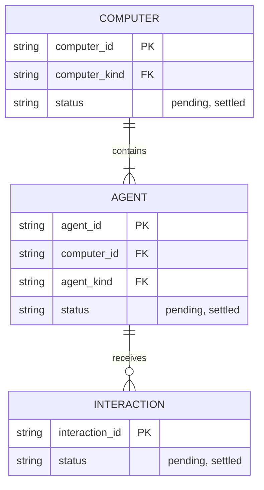

# MCP Patterns — Entities and Relationships

```mermaid
erDiagram
  COMPUTER ||--|{ AGENT : contains
  AGENT ||--o{ INTERACTION : receives

  COMPUTER {
    string computer_id PK
    string computer_kind FK
    string status "pending, settled"
  }

  AGENT {
    string agent_id PK
    string computer_id FK
    string agent_kind FK
    string status "pending, settled"
  }

  INTERACTION {
    string interaction_id PK
    string status "pending, settled"
  }
```
