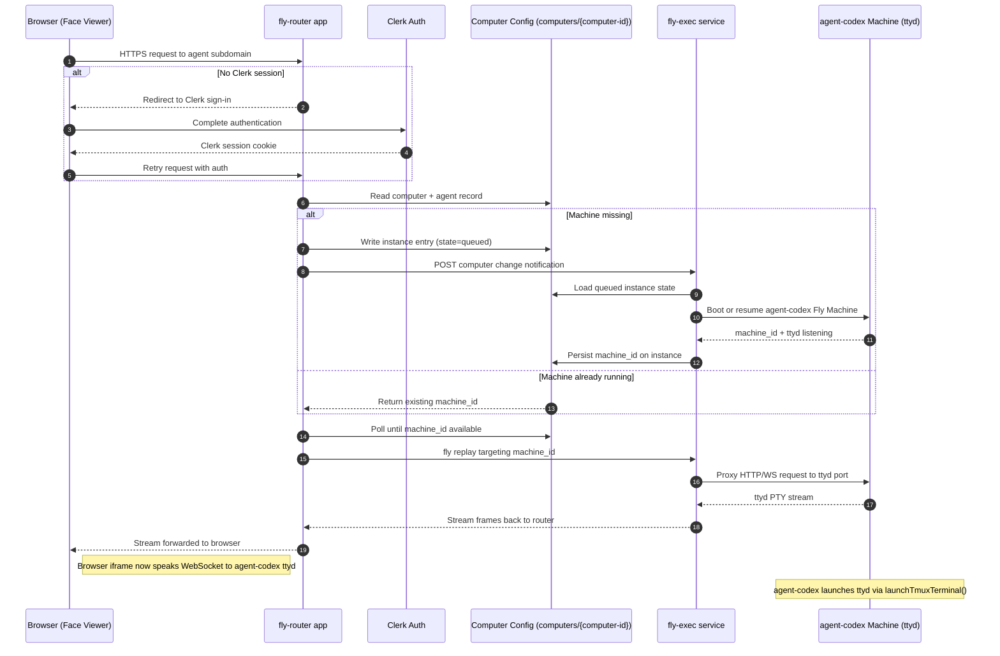
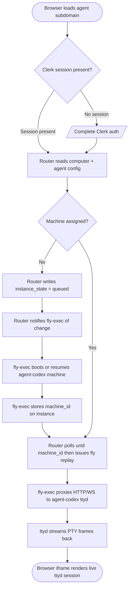

# Router to agent-codex ttyd Workflow

This workflow tracks how an incoming browser request is shepherded by the Fly router until the browser is streaming a terminal session from the `agent-codex` ttyd server.

