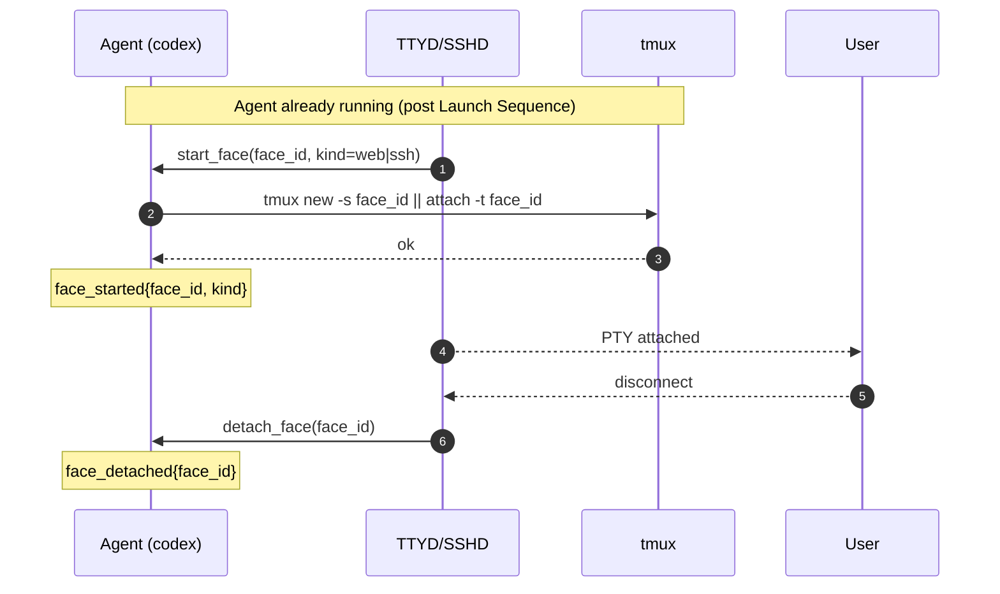
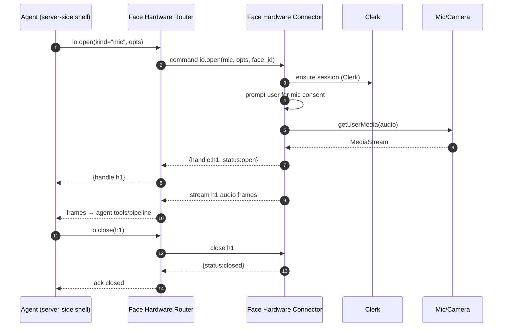

**Runtime Model**

This document defines how an agent process is launched and managed inside its container.

**Launch Sequence (accepted — locked 2025-08-28)**

- Locked: changes require an ADR update (see `ADRs/0002-mcp-invocation-and-codex-home.md`).
- **Trigger:** An `mcp` tool call (`runtime.launch_agent`) is received by the MCP host after the
  container reports Ready.
- **Inputs:** `agent_id`, `app`, `machine_id`, `config_toml` (string), optional `codex_args`
  (array), optional `env` (map), optional `workdir` (string).
- **Steps:**
  - **Create CODEX_HOME:** Make a per‑agent directory (default `/var/lib/codex/agents/{agent_id}`)
    with `0700` perms.
  - **Write config.toml:** Save provided contents to `$CODEX_HOME/config.toml` with `0600` perms.
  - **Assemble env:** Export `CODEX_HOME` (required). Merge `env` overrides, preserving a minimal
    safe `PATH`.
  - **Invoke codex:** `exec /usr/local/bin/codex ${codex_args…}`. The process reads
    `$CODEX_HOME/config.toml`.
  - **Wire IO:** STDOUT/ERR stream to container logs.
  - **Return handle:** Tool returns `{launch_id, pid, ssh_target}`.

See also: canonical diagrams in `DIAGRAMS.md` under “Launch Sequence (canonical)”.


Caption: Launch Sequence from MCP call to codex exec.

**Reference Implementation (launcher shim)**

```bash
#!/usr/bin/env bash
set -euo pipefail

agent_id=${AGENT_ID:?missing}
CODEX_HOME="/var/lib/codex/agents/${agent_id}"

install -d -m 700 "${CODEX_HOME}"
install -m 600 /dev/stdin "${CODEX_HOME}/config.toml"

export CODEX_HOME
exec /usr/local/bin/codex "$@"
```

Call over SSH from the MCP host with the `config.toml` piped on STDIN.

**Error Handling**

- **E_CONFIG_WRITE:** Cannot create/write `$CODEX_HOME/config.toml`.
- **E_BAD_ARGS:** Invalid `codex_args` or env values.
- **E_SPAWN:** `codex` missing or not executable.

**Security Notes**

- `CODEX_HOME` is per‑agent and not shared; use volume mounts only if persistence is required.
- File perms are restrictive (`0700` dir, `0600` file). Never echo configs to world‑readable logs.

**Infrastructure Access (accepted — 2025-08-30)**

- Customer apps do not hold Fly API tokens. When agents need infrastructure (create/update Machines,
  etc.), they call MCP tools exposed by the central Artifact app, which holds the org‑scoped token
  `FLY_ORG_TOKEN`.

**Artifact MCP — Provisioning Tool Contracts (accepted — 2025-08-30)**

Namespace: `infra.*` (served by the Artifact app’s MCP host)

- `infra.ensure_app(name, region)` → `{ app, created }`
  - Creates the app if missing; idempotent.
- `infra.create_machine(app, image, region, size?, cmd?, files?, env?, services?)` →
  `{ machine_id, state }`
  - `files`: array of `{ path, literal?, secret_name? }` to project config at boot.
  - `size`: e.g., `shared-cpu-1x@1024MB` (impl-defined mapping to CPUs/RAM).
- `infra.update_machine(app, machine_id, patch)` → `{ machine_id, state }`
- `infra.destroy_machine(app, machine_id)` → `{ ok: true }`
- `infra.list_machines(app)` → `{ machines: [...] }`
- `infra.set_secret(app, name, value)` → `{ ok: true }`
  - For non‑Fly secrets required by the agent runtime; Artifact decides what is permissible.
- `infra.rotate_org_token()` → `{ rotated_at }`
  - Rotates `FLY_ORG_TOKEN` held by Artifact (no per‑app tokens exist).

Security:

- Artifact authenticates the caller (customer app) and authorizes per‑app actions (e.g., app name
  prefix or allowlist).
- All actions are audited with `{app, user, tool, params-hash}`.

**Fly.io Boot‑Time Config**

- **Goal:** Provide `config.toml` at machine creation without post‑boot steps.
- **Mechanism:** Fly Machines “files” feature writes content into a path inside the guest during
  create/update. No SSH needed; content is present before your process starts. See `REFERENCES.md`
  entries `FLY-MACHINES-RUN`, `FLY-MACHINES-CREATE`, and `FLY-APP-FILES`.

**Recommended (literal → path)**

- Use `--file-literal` to inject the TOML contents directly:

```bash
# Create & start a Machine, writing config at boot
fly machine run <image> -a <app> \
  --file-literal /etc/agent/config.toml="$(< ./config.toml)" \
  --cmd "codex --config /etc/agent/config.toml"

# Or do the same on low-level create
CONFIG_TOML="$(< ./config.toml)"
fly machine create -a <app> --image <image> \
  --file-literal /etc/agent/config.toml="$CONFIG_TOML" \
  --cmd "codex --config /etc/agent/config.toml"

# Update/rotate later without SSHing into the guest
fly machine update <machine_id> \
  --file-literal /etc/agent/config.toml="$(< ./config.toml)"
```

Notes:

- You can pass plaintext to `--file-literal`; flyctl Base64‑encodes it for `files.raw_value`, and
  the Machines agent decodes and writes the original bytes to the path at create/update. You do not
  need to pre‑encode. The `machine create -h` text mentions Base64 because the underlying
  `raw_value` field is Base64 in the API/config. See refs.
- For very large configs, prefer `--file-local` or mount a volume; there’s a practical size limit
  for values embedded in Machine config.
- Sensitive configs: store in Secrets and project them as a file via
  `--file-secret /path=SECRET_NAME`.

**Fly.io Storage Defaults (note)**

- Root filesystem is ephemeral. Default total size is 8GB on non‑GPU Machines (50GB on GPU
  Machines). Available free space equals this total minus your image’s unpacked size, so fresh,
  minimal images typically leave ~7+ GB free. See refs `FLY-ROOTFS-LIMITS`.
- Ephemeral rootfs performance is capped at ~2000 IOPs and ~8 MiB/s bandwidth, independent of
  Machine size. For persistence or higher throughput, attach a Fly Volume. See ref
  `FLY-VOLUMES-OVERVIEW`.

**Launcher Interop**

- If the file is provided at `/etc/agent/config.toml`, the launcher MAY skip stdin write and point
  codex at that path. If both are provided, launcher precedence is: explicit stdin > existing file.

**Face Model (proposed)**

- **Goal:** Allow a single agent/container to host multiple concurrent user faces.
- **Mechanism:** One `tmux` server per agent; one `tmux` session per `face_id`. Web attaches via
  TTYD; SSH attaches the PTY directly. Faces are isolated at the terminal/process group level but
  share the agent process and container resources.
- **Limits:** Concurrency is capped via config (e.g., `max_faces`) to protect CPU/RAM. When
  exceeded, the agent rejects new faces with a clear error.
- **Lifecycle:** create → attach/detach → idle → suspend/evict. Eviction policies MAY close oldest
  idle faces first.
- **Identity propagation:** Expose `FACE_ID` and `FACE_KIND` (`ssh|web`) in the face env; log face
  start/stop and attach/detach events.



Caption: Face start/attach lifecycle inside a single running agent.

---

**Face Hardware Connector (proposed)**

- Goal: Present the user’s browser as a device-like I/O surface to the agent, while the page remains
  attached to a single active `face_id` for terminal UI.
- Subcomponents in the page:
  - Face Viewer (TTYD iframe) — renders the terminal for the current face.
  - Face Hardware Connector — authenticates (Clerk), prompts for device permissions, and executes
    commands from the server-side shell to open/close/stream resources (mic, camera, screen, files,
    navigation/redirect).
- Identity: The connector attaches Clerk identity/claims (via Browser Auth) to I/O requests.
  Authorization decisions happen server-side; the browser only mediates capability prompts and local
  consent.
- Scoping: Exactly one face per page. Streams and handles are bound to the Page Session (the current
  page/tab and its `face_id`).

Hardware MCP (initial sketch)

- Exposed by the Face Hardware Router as an MCP server to the agent. Tools:
  - `hardware.enumerate(kind)` → `[device]` (mic|camera|screen|file|other)
  - `hardware.open(kind, opts)` → `{handle}`
  - `hardware.subscribe(handle, events)` → streaming events/frames
  - `hardware.write(handle, chunk)` → `{ok}` (when applicable, e.g., file sinks)
  - `hardware.close(handle)` → `{closed}`
  - `page.redirect(url)` → `{redirected}` (navigate page to another agent/face)

Notes

- Transport MAY be WebSocket end-to-end; media MAY use WebRTC or chunked WS frames. The command
  contract is the source of truth; transport is an implementation detail.
- Error semantics mirror device-like codes: `E_DENIED`, `E_UNAVAILABLE`, `E_CLOSED`, `E_TIMEOUT`.



Caption: The agent asks the page to open the microphone; the connector authenticates, prompts for
consent, streams frames, and closes on command.

---

**Face Router Proxies (proposed)**

- Face View Router (terminal WS): The Face Viewer connects to the Face View Router; it connects to
  the Agent’s TTYD and relays frames.
- Face Hardware Router (MCP): The Agent calls the Face Hardware Router’s Hardware MCP; it mediates
  auth/policy and dispatches to the Face Viewer’s Face Hardware Connector over its control channel.
- Redirects: The Face Router may 302 to normalize host/path to the user’s app/agent path before
  proxying.

---

**Agent Controller (proposed)**

- Role: In‑container control process that creates/manages faces (tmux), persists state to Artifact,
  restores on boot, and exposes/consumes tools as needed.
- Artifact MCP for lifecycle (sketch):
  - `agents.spawn_child(spec)` → `{agent_id}`
  - `agents.spawn_peer(spec)` → `{agent_id}`
  - `agents.destroy_self()` → `{ok}`
  - `agents.lookup(name)` → `{agent_id, path}`
  - Implemented by Artifact; creation flows may chain into `infra.*` tools.

---

**Concurrency & Faces (proposed)**

- **Naming:** “Face” is canonical (legacy: session). One tmux session per face.
- **Modes:**
  - `single-face`: One face per agent (default “main” face). Attempts to create another face are
    rejected with `E_FACE_LIMIT`.
  - `multi-face` (default): Multiple faces per agent. Each landing without a `?face=` creates a new
    face and redirects to the Face URL.
- **UI Contract:** The agent presents one interface; users can switch the attached session via a
  face/session switcher overlay or commands.
- **Filesystem & State:** All faces share `$CODEX_HOME`, working directory, and the same container
  resources. Do not assume filesystem isolation per face.
- **Controls (TOML):**

```toml
[concurrency]
mode = "multi-face"           # "single-face" | "multi-face"
max_faces = 20                 # hard cap per agent container
face_idle_close_secs = 1800    # close faces after idle
```

- **Behavior:**
  - Landing (no query):
    - multi-face → create new face → 302 to `?face={id}`.
    - single-face → attach to the main face (stable id) without creating a new one.
  - Switch: `faces.switch(face_id)` (UI: `/faces`) reattaches the single interface to another face.
  - Close: `faces.close(face_id)` ends the face; files persist on disk.
  - Limits: If `max_faces` reached, return HTTP 429 with error `E_FACE_LIMIT` and guidance to close
    an existing face.
  - Events: `face_created`, `face_attached`, `face_detached`, `face_closed`.


Caption: Landing flow for multi-face agents with Face URL redirect.

---

**State Persistence & Restore (proposed)**

- Goal: Allow agents to optionally persist overall state on persistence events and optionally
  restore it on next start.
- Model:
  - Live faces are ephemeral (tmux-backed). No continuous per-turn persistence is required.
  - On a Persistence Event (autosuspend/upgrade/manual snapshot), the agent MAY serialize a freeform
    JSON “Agent State Object” and store it via the Artifact Storage Layer.
  - On launch, the agent MAY load the latest snapshot and restore overall state. Multi-face agents
    MAY rehydrate faces from the snapshot. Rehydrated faces are inert until attached.
- MCP (sketch):
  - `artifacts.save_state(app, machine_id, agent_id, state_json)` → `{version, stored_at}`
  - `artifacts.load_state(app, machine_id, agent_id)` → `{state_json, version, stored_at}|null`
- Example (illustrative only):

```json
{
  "agent": { "id": "base@alice", "version": "v2" },
  "workspace": { "repos": ["main", "infra"], "scratch": ["s-123"] },
  "faces": [
    { "face_id": "42", "title": "Chat", "kind": "chat", "state": { "thread": [/*...*/] } },
    { "face_id": "43", "title": "Logs", "kind": "logs", "state": { "cursor": 102938 } }
  ]
}
```

- Security: State may contain sensitive data. Apply redaction policies; encrypt at rest in the
  Artifact Storage Layer; avoid logging full payloads.
- Limits: Snapshots should be size-bounded; consider pruning transient data before save.

---

**Workspace Initialization (proposed)**

- **Goal:** Ensure `/workspace` exists and required repos are present before the agent accepts
  faces/sessions.
- **Inputs:** `$HOME/workspace.toml` (Workspace Manifest) and `[workspace.*]` keys in `config.toml`.
- **Steps:**
  1. Create `/workspace` (0700) if missing; verify free space and quotas.
  2. For each manifest repo, if path missing → `git clone`; else → `git fetch` and `git checkout`
     the requested ref; apply sparse rules if set.
  3. Create scratch root `/workspace/.scratch` (0700).
  4. Emit `workspace_ready` event.

- **TOML (example):**

```toml
[workspace]
root = "/workspace"
scratch_root = "/workspace/.scratch"
max_total_mb = 20480          # 20 GB
max_repos = 20
scratch_ttl_secs = 604800     # 7 days
gc_on_launch = true
codex_config_path = "/home/agent/codex.toml"

[[workspace.repos]]
name = "main"
url = "git@github.com:example/main.git"
ref = "main"                  # branch|tag|sha
sparse = ["src/", "docs/"]    # optional

[[workspace.repos]]
name = "infra"
url = "https://github.com/example/infra.git"
ref = "v1.2.3"
```

- **Runtime API (sketch):**
  - `workspace.repos()` → list ensured repos
  - `workspace.add_repo(url, name?, ref?, sparse?)` → ensure checkout under `/workspace/{name}`
  - `workspace.new_scratch(name?)` → `/workspace/.scratch/{id}` (initialized Git repo)
  - `workspace.gc(force?)` → enforce quotas and TTL; return reclaimed bytes

- **Notes:**
  - All faces share the same workspace; concurrent Git ops must lock per repo path.
  - Scratch repos have no remotes by default; pushing requires explicit `git remote add`.
  - If `/workspace` is a volume, persistence extends across agent restarts; otherwise it is
    ephemeral.
