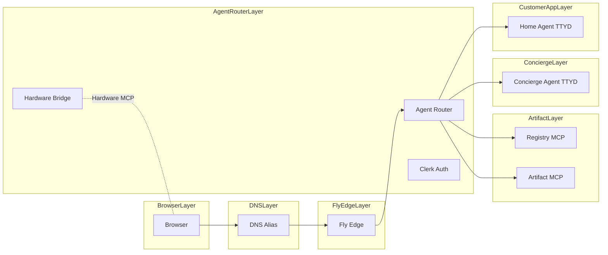
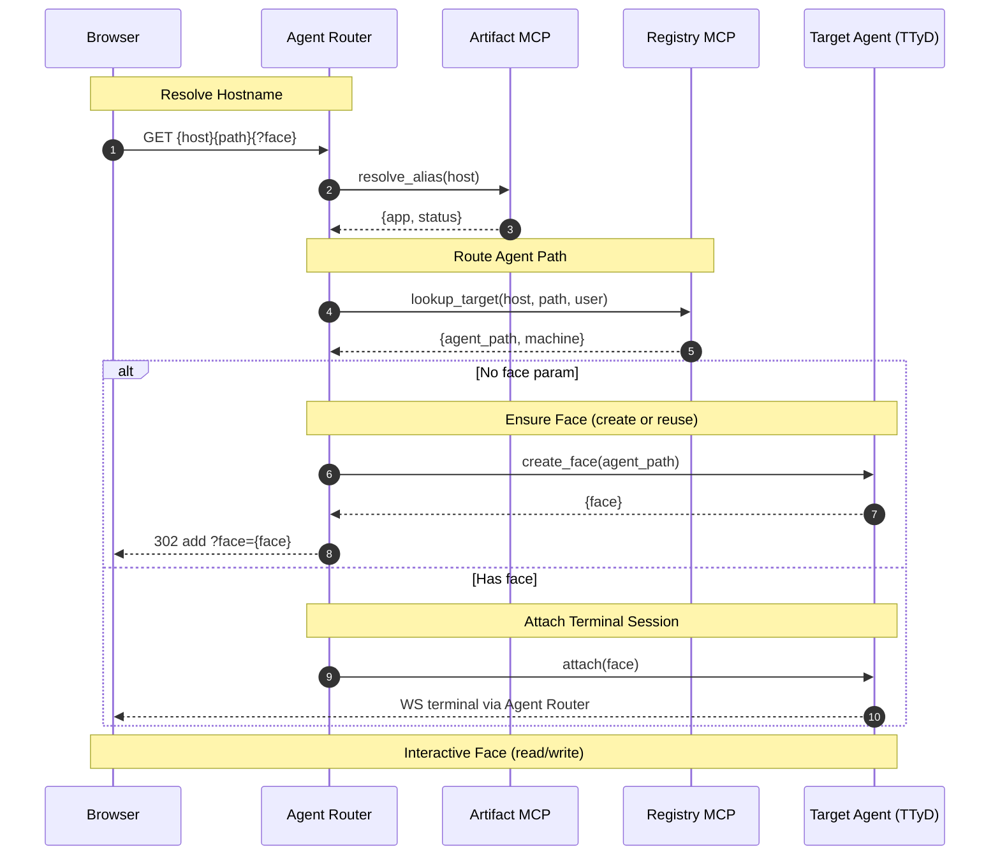
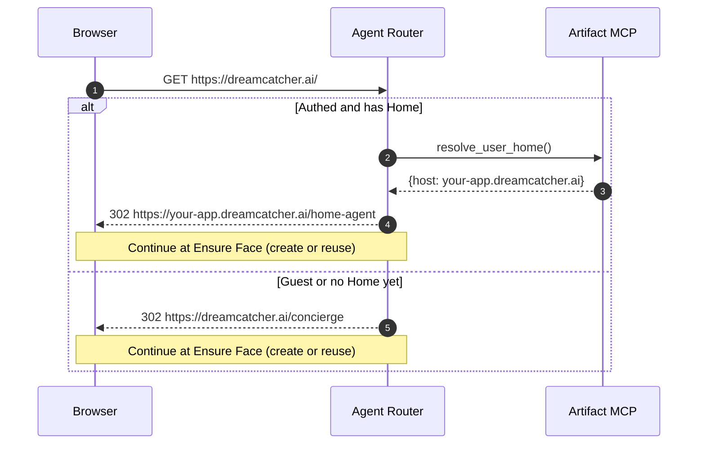
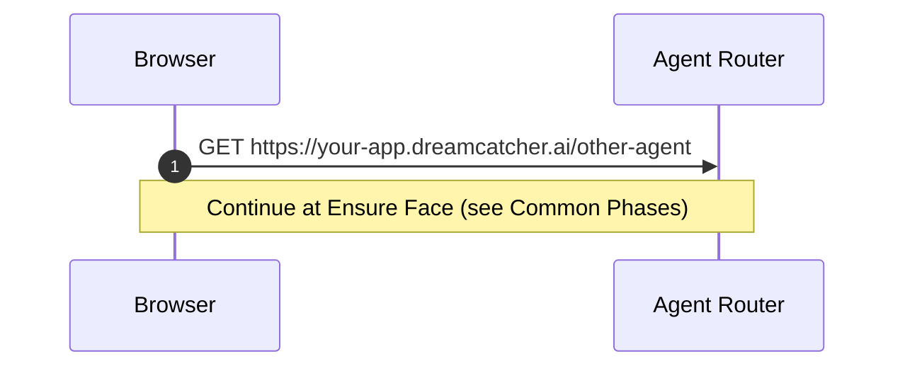
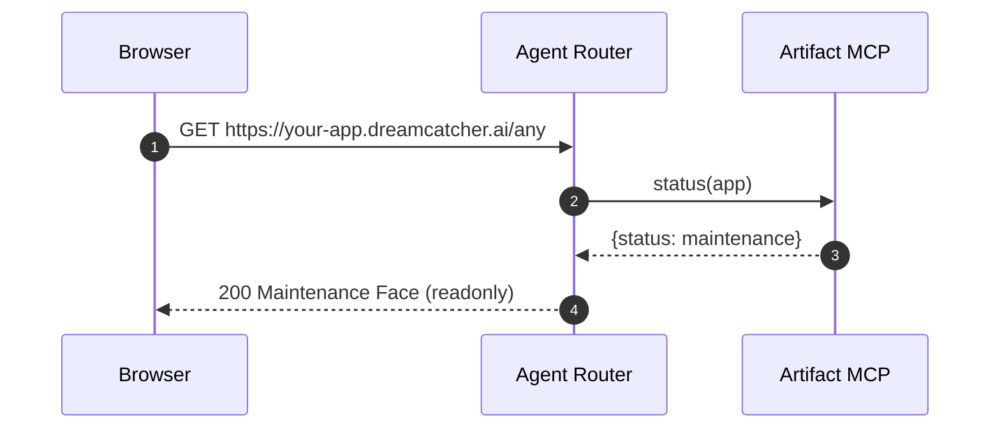

This is a list of all the URLs we expect to handle and in all the possible
system states. Some of these would do redirects, and some would be the final
resolved target.

1. `https://dreamcatcher.ai`
   - with auth
     - has home
       - redirect to `https://your-app.dreamcatcher.ai`
     - no home / home being constructed
       - trigger idempotent mcp call that returns a view to watch progress
   - without auth
     - redirect to `https://dreamcatcher.ai/home-agent`
2. `https://dreamcatcher.ai/home-agent`
3. `https://dreamcatcher.ai/some-garbage`
   - redirect to `https://dreamcatcher.ai` - standard agent not found path
4. `https://your-app.dreamcatcher.ai`

- is valid app
  - is public or is authed
    - redirect to `https://your-app.dreamcatcher.ai/home-agent`
  - invalid app
    - redirect to `https://dreamcatcher.ai`

5. `https://your-app.dreamcatcher.ai/home-agent/nested-agent`
6. `https://your-app.dreamcatcher.ai/other-agent`
7. `https://your-app.dreamcatcher.ai/other-agent?face=0`
   - if valid app and is authed or is public
     - return base system view
8. `https://your-app.dreamcatcher.ai/other-agent?face=1`
   - if valid app, is authed, or is public
   - if face not found - start a new face - standard face not found path

---

**Visualization (proposed)**

Goal: Show every URL pattern, how it resolves across Fly apps, and which
component is responsible at each hop — without duplicating common steps.

- Canonical flow: one URL-resolution flowchart with subgraphs per Fly app.
- Phases: a single sequence diagram with named phases (Resolve Hostname, Route
  Agent Path, Ensure Face, Attach Terminal Session, Interactive Face) that
  define the shared steps (resolve, route, ensure face, attach).
- Per-URL journeys: short sequences that run just until they reach a phase
  label, then hand off by reference (e.g., “Continue at Ensure Face”).

### URL Resolution Map (canonical)

Caption: Subgraphs represent Fly apps. The Agent Router authenticates and routes
requests; Registry and Artifact provide mapping and control; target Agents
expose TTYD behind the Router.

### Common Phases (shared sequence)

Caption: Reusable phases. Per-URL journeys may stop once they reach “Ensure
Face” or “Attach Terminal Session” and reference this sequence instead of
duplicating.

### Per-URL Journey Templates

Root domain (concierge or handoff to home):

App host and agent path:

Maintenance mode (read-only face):

Notes

- One face per page: landing without `?face` triggers Ensure Face and 302 to add
  `?face={id}`.
- Per-URL diagrams should end at Ensure Face or Attach Terminal Session and
  reference the Common Phases to avoid duplication.
- Subgraphs name Fly apps explicitly: Agent Router, Artifact, Concierge,
  Customer App.

### URL Patterns (reference)

- Root: `https://dreamcatcher.ai/` → concierge or handoff.
- Concierge: `https://dreamcatcher.ai/concierge[?face=…]`.
- App alias: `https://your-app.dreamcatcher.ai/{agent_path}/[?face=…]`.
- App fallback: `https://{app}.fly.dev/{agent_path}/[?face=…]` (may normalize to
  alias).
- Faces index: `/{agent_path}/faces` (alias `/sessions`).
- Auth callbacks: `/auth/callback`, `/logout`, `/me` on Router host.
- Health: `/_healthz`, `/_readyz`, `/_version` on Router (and optionally
  agents).
