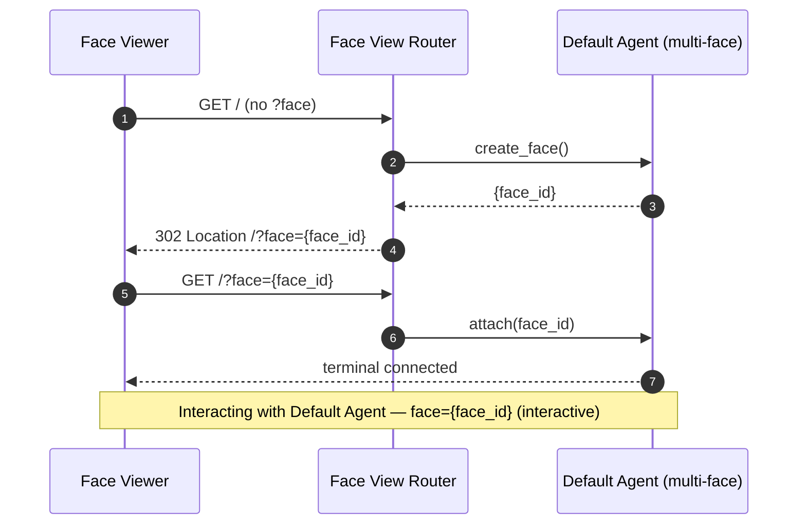
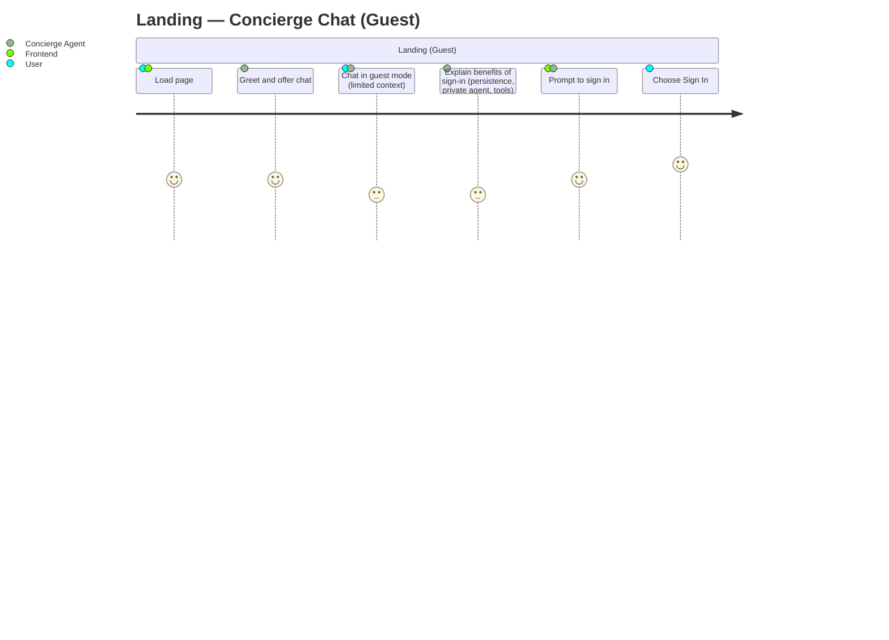
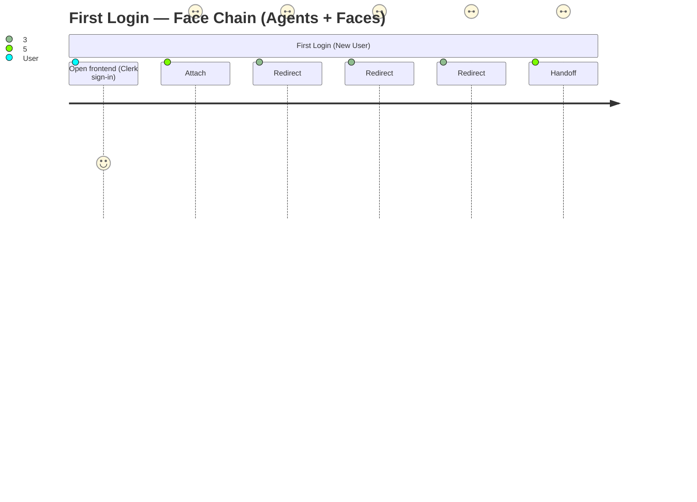
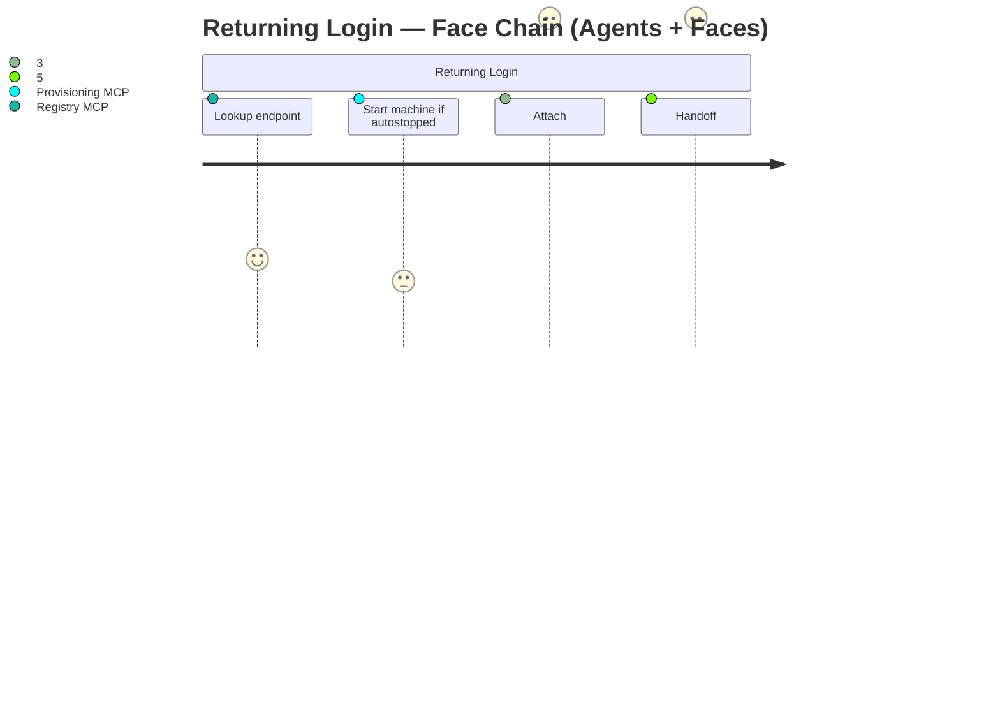
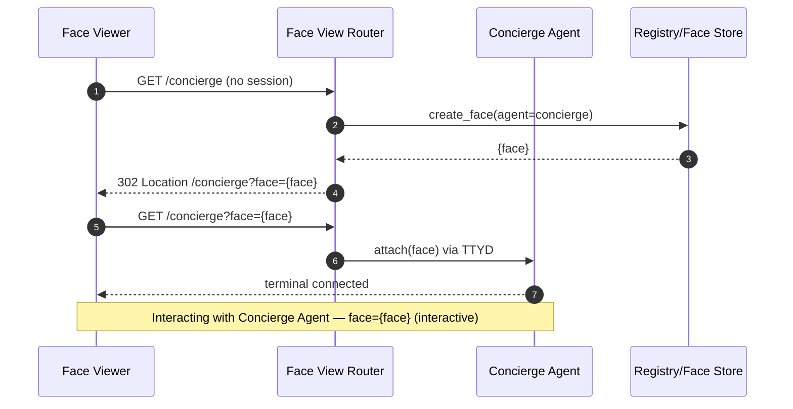
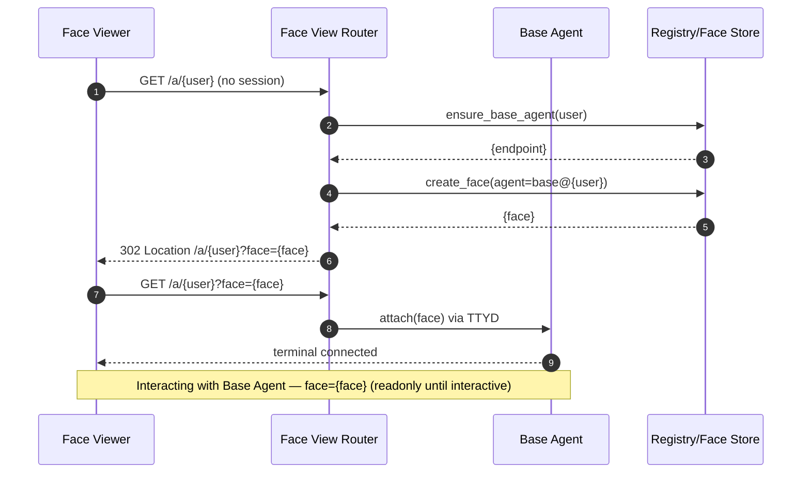

**Public Root Flow (Open Access)**

- **Entry Point:** User opens `/` (root). The app serves the default agent path as a regular
  multi-face agent page. No login; access is public.
- **Behavior:** If the URL lacks `?face=`, the app asks the agent to create a new face and redirects
  to `/?face={face_id}`. Each tab gets a distinct face.
- **Face ID:** The agent generates a monotonic `face_id` (URL-safe, scoped to the agent).
- **Resumption:** Returning to a valid `?face=` reattaches that face if it is still active; if not,
  show a friendly error with a button to start a new face.
- **Limits:** Enforced by the agent’s concurrency config (`max_faces`, idle close). Exceeding the
  limit yields HTTP 429 with guidance to close an existing face.
- **Persistence (initial):** Face state is in-memory (e.g., tmux). Deep links remain valid until the
  face idles out or the container restarts. Optional snapshot-based recovery is described below.

Caption: Public root attaches to a default multi-face agent with session redirect.

---

**New User Bootstrap Flow**

- **Entry Point:** User opens the Frontend Web App, authenticates with Clerk, and lands on the
  workspace page. The terminal UI is an iframe rendering a TTYD endpoint.
- **Goal:** If first-time, provision a dedicated “base agent” on Fly.io and point the iframe at that
  agent’s terminal; otherwise, attach to the user’s existing base agent session.

**Assumptions** (updated 2025-08-31)

- **One org, many apps:** All resources live in a single Fly organization; we create one app per
  customer.
- **Artifact app (infra):** Central control-plane MCP host that provisions Machines inside any
  customer app.
- **Base agent per user:** Each user gets a base agent Machine in their Customer App.
- **Standard image:** Base agents use a common image configured at boot (no volumes initially).
- **MCP-backed ops:** Frontend/concierge calls MCP servers for provisioning, auth/registry, secrets,
  and runtime.
- **Terminal transport:** Browser → Frontend page → iframe → agent’s TTYD (WebSocket). Sessions
  inside the agent are managed with `tmux`.

**User Journey — Landing (Guest Chat)**

Caption: Pre-auth landing flow where the Concierge chats in guest mode and nudges sign-in for full
features.

**User Journey — First Login** (revised for Artifact + Customer App)

Caption: Progress is shown by attaching the browser to the live face doing the work. Faces may be
readonly until the interactive base face is ready.

**User Journey — Returning Login**

Caption: Returning user attach flow with health gates and ratings.

**Happy Path (First Login)** (revised)

- **U1. Sign-in:** User authenticates with Clerk in the frontend.
- **U2. Identify:** Frontend resolves `user_id` and `username` via Clerk; Registry MCP lookup for
  existing base agent.
- **U3. Customer App:** Create a Customer App with friendly random name in the shared org.
- **U4. Launch Machine:** Create one Machine in the Customer App with the standard image, CPU/RAM:
  `1 shared vCPU, 1GB RAM`; no volumes.
- **U6. Face Chain:** Browser redirects to the provisioning job face (readonly), then to base
  machine face zero (readonly) while the agent starts.
- **U7. Launch Agent:** Call `runtime.mcp.launch_agent` (see RUNTIME “Launch Sequence”) to write
  `config.toml`, set `CODEX_HOME`, and exec `codex`.
- **U8. Attach:** Frontend sets the iframe `src` to the agent’s TTYD endpoint (prefer friendly alias
  in the URL); the agent starts/attaches a face (one tmux session per face).

**Repeat Login (Existing User)**

- **R1. Lookup:** Frontend/Registry MCP finds the base agent endpoint.
- **R2. Ensure Up:** If autostopped/suspended, Provisioning MCP (or Fly Proxy autostart) brings it
  up. The browser attaches to the current job face as soon as it exists (readonly if still
  initializing).
- **R2a. Ensure Agent:** If `codex` is not running, call `runtime.mcp.launch_agent`.
- **R3. Attach:** Frontend points the iframe to the TTYD URL and reattaches the user’s `tmux`
  session.

**Failure Handling (Sketch)**

- **F1. Provision error:** Show concise error + incident code; offer retry or support link.
- **F2. Initialization delay:** Keep the user attached to the readonly job/boot face; no separate
  “show logs” UI.
- **F3. Auth mismatch:** Deny with clear message; session remains on frontend.

**Notes on “Handoff”**

- In this model, “handoff” simply means routing the iframe to the per-user agent’s TTYD URL. No SSH
  jump or client command is involved.

**Face Router Proxying** (added)

- Terminal: The Face Viewer connects via WebSocket to the Face Router, which proxies to the target
  Machine’s TTYD. Machines do not perform auth; the Face Router gates access.
- Hardware: Agents call the Face Router’s `hardware.*` MCP tools; the Face Router enforces
  capability policy and bridges to the Face Viewer’s Face Hardware Connector. Two-way: agents can
  request to open/close devices and receive streams; they can also trigger `page.redirect` to move
  the page to another agent/face.

**Artifacts Produced**

- Per-user Fly app and Machine
- Stored config/secrets for the agent
- Registry entry linking user → app → machine → hostname
- Progress is visible via faces (no separate logs/metrics UI)

**Defaults and Policies** (revised)

- **App name:** friendly, random globally-unique slug (two-words + digits, e.g.,
  `calm-meadow-4821`).
- **Org:** Single shared org; one app per customer (see ADR 0009).
- **Region:** nearest Fly region to user at first provision.
- **Sizing:** 1 shared vCPU, 1GB RAM.
- **Storage:** no volumes.
- **Idle policy:** suspend/stop on idle via Fly Proxy autostop; autostart on new HTTP/WebSocket
  traffic.
- **Secrets:**
  - Artifact app only: `FLY_ORG_TOKEN` (org‑scoped token to manage apps/Machines across the org).
    Customer apps store no Fly API tokens.
- **Faces:** managed via `tmux` (one tmux session per face); multiple viewers may attach when
  allowed by frontend.
- **Friendly DNS:** one or more aliases point to `{app}.fly.dev`; bookmarks prefer aliases.

**Multi‑Face Mechanics (proposed)**

- **One interface per agent path:** The terminal UI is singular; users switch between faces via
  `/faces` (alias: `/sessions`) or shortcuts.
- **Shared workspace:** All faces share the same working directory and `$CODEX_HOME`.
- **Limits:** `concurrency.max_faces` caps concurrent faces; attempts beyond this return a clear
  error with guidance to close a face first.
- **Persistence:** Closing a face tears down in‑memory state only; files remain on disk.

**Open Items**

- Region selection method: compute nearest Fly region from request IP, or show a picker with a
  sensible default.

---

**URL Scheme & Face Routing (proposed)**

- **App host:** `{app}.fly.dev`.
- **Agent path:** `/{agent_path}/` (supports hierarchy, e.g., `/agent1/child-agent-2/`).
- **Face URL:** `/{agent_path}/?face={face_id}`. Exactly one face per browser page.
- **Default page → Face URL:** Landing on a page without a `face` param creates a new face on the
  target agent (Concierge or Base) and redirects to the Face URL.
- **Resume with face:** Landing with a valid `face` reattaches; invalid/expired `face` yields a
  friendly error and an option to start a new face.
- **No per-user container for Concierge:** Concierge operates as a shared agent container hosting
  many sessions; users get sessions, not containers.
- **Multiple tabs:** Each browser tab gets its own `face`; viewers may attach to the same face when
  authorized.
- **Friendly alias:** `{alias_host}/{agent_path}/?face={face_id}` (preferred for bookmarks).

**Maintenance Mode (proposed)**

- **Trigger:** Artifact marks the app as `maintenance` (e.g., recreate or upgrade in progress).
- **Behavior:** Friendly DNS continues to resolve; requests to any agent path render a full but
  read-only maintenance face with progress and ETA. Authenticated users may see more detail.
- **Recreate path:** Artifact can recreate the app using state (repos, config) and then re-point DNS
  aliases back to the new `{app}.fly.dev`.
- **Exit:** Clear maintenance flag; resume normal faces; bookmarks remain valid.

**Face Persistence Policy (snapshot-based)**

- **Ephemeral by default:** Live faces exist only in-memory (e.g., tmux) and expire on idle or
  container restart.
- **Snapshot on persistence events:** When the container persists itself (e.g., autosuspend,
  upgrade, manual snapshot), the agent MAY write an overall freeform JSON state object to the
  Artifact Storage Layer. A multi-face agent MAY include a list of faces and optional per-face state
  in that object.
- **Restore behavior:** On next start, the agent MAY read the last snapshot to restore overall state
  and optionally rehydrate faces. Rehydrated faces are not live PTYs until reattached; deep links
  only resume if the snapshot retained those `face_id`s.
- **Security note:** Face IDs are not secrets; authorization is enforced by Artifact. Mask IDs in
  logs by default; expose only short hashes in UI.

Caption: Default concierge page redirects to a Face URL and attaches that face.

Caption: Base agent page ensures agent exists, then creates and attaches a session.
