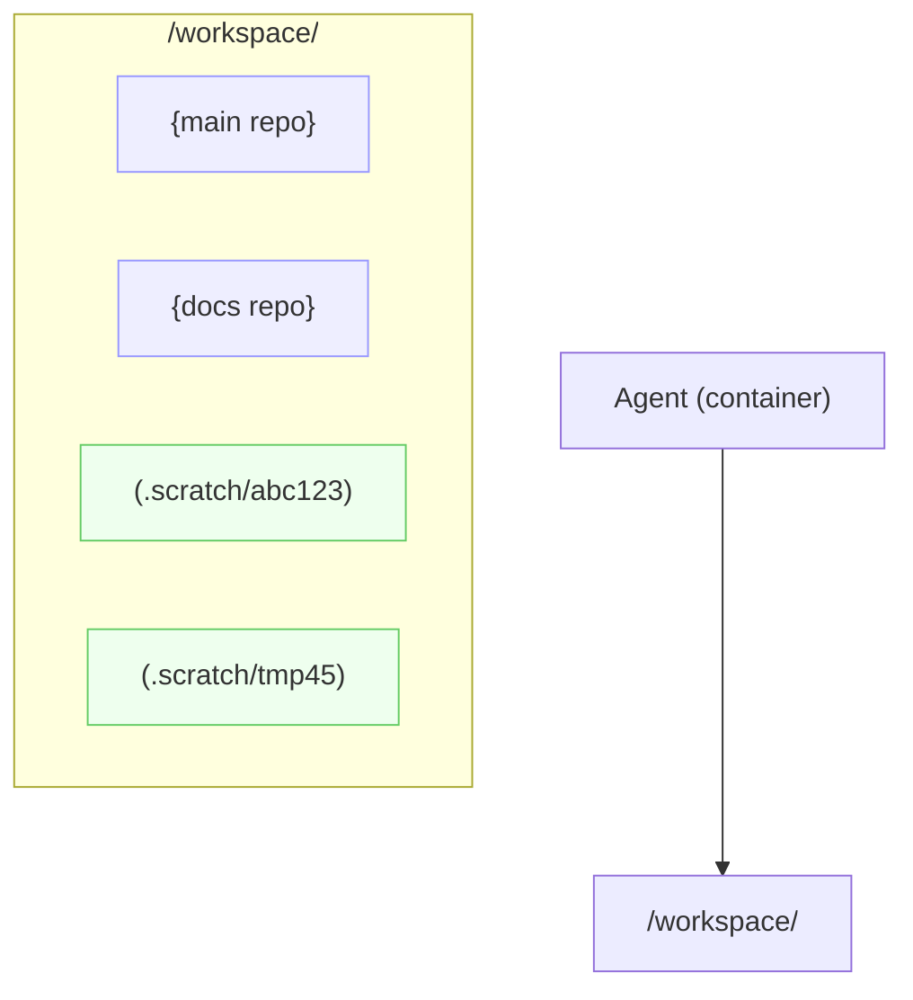

# Agent Workspace

Defines the filesystem layout and policies for an agent’s working area.

**Overview**

- Root: `/workspace`
- Contents: one or more Git repos, plus a scratch area for ephemeral repos.
- Scope: shared by all faces/sessions within the same agent (container).
- Boundary: the agent/container is the unit of mutability and pooling; use a new agent for different
  isolation needs.

**Layout**

```
/workspace
  /{repo_name}          # Git checkout (tracked repo)
  /.scratch/{id}        # Scratch Git repo (ephemeral)
  /.cache               # Optional caches (tooling)
```

**Initialization**

- On launch, the agent ensures `/workspace` exists and materializes the repos from the Workspace
  Manifest.
- Scratch root `/workspace/.scratch` is created and subject to TTL/GC.

**Workspace Manifest**

- Path: `$HOME/workspace.toml`
- Example:

```toml
[workspace]
root = "/workspace"
scratch_root = "/workspace/.scratch"
max_total_mb = 20480
max_repos = 20
scratch_ttl_secs = 604800
gc_on_launch = true
codex_config_path = "/home/agent/codex.toml"

[[workspace.repos]]
name = "main"
url = "git@github.com:example/main.git"
ref = "main"

[[workspace.repos]]
name = "docs"
url = "https://github.com/example/docs.git"
ref = "v1.0.0"
```

**Scratch Repos**

- Created under `/.scratch/{id}`; initialized as Git repos without remotes.
- Default TTL (e.g., 7 days). GC may remove expired scratch repos when over quota or on launch.
- To persist, user must push to a remote or move content into a tracked repo.

**Operations (sketch)**

- `workspace.add_repo <url> [--name <name>] [--ref <ref>] [--sparse <paths...>]`
- `workspace.list`
- `workspace.new_scratch [name]` → prints path
- `workspace.gc [--force]`

**Codex Config**

- File `~/codex.toml` contains codex runtime settings. The manifest’s `codex_config_path` points to
  this file; agents SHOULD load it during launch in addition to the locked
  `$CODEX_HOME/config.toml`.

**Concurrency**

- Serialize Git operations per path. Faces share the same filesystem; lock around
  clone/fetch/checkout.

**Persistence**

- If `/workspace` is backed by a volume, contents survive restarts; otherwise consider it ephemeral.
- Secrets for Git auth are provisioned outside the workspace (see `CODEX_HOME` and secrets docs).

**Diagram**



Caption: Workspace root hosting tracked repos and ephemeral scratch repos.
